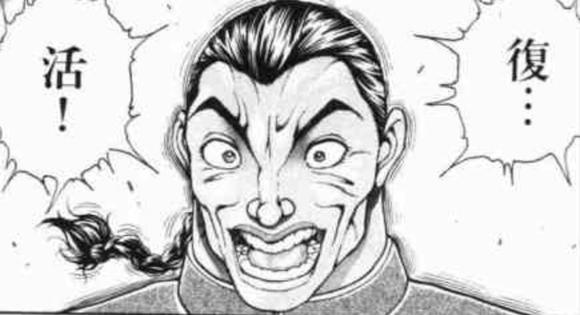

## 2022.12.11 - 2023.05.17

嘛，就像是一场梦。

新生赛第六进入集训队的欣喜、codeforces的下马威、寒假牛客训练营的坐牢、下午的uva刷题、集训的或是集体坐牢或是轮流A题、div.3个人最好记录的自得、2023 GDCPC SZUT的两日游（隔音奇差、每隔一个小时就被吵醒一次的屑酒店，GDCPC的打铁）......

竞赛这条路还是不太适合我啊（笑）

## 后记（？）

没有什么遗憾 ~~（flag，快进到后知后觉）~~ ，不过心情也是有一丝复杂。至少，我也在ACM的大门前往里看了几眼，仰望过高峰 \_(:з」∠)\_

年仅半年的ACMer生涯，堂堂完结！

-----

## 复！活！

TNND，真是被看扁了呀！ 
爱的力量，是无限的！（筋肉魔理沙.jpg）

嘛，大概是一时脑抽了——毕竟长时间的高压训练和GDCPC的出师不利也挺打击学习的热情的。不过，现在我的看法是：

>只要我在无数次的 WA, TLE 后的 AC 仍能欣喜若狂，我就能打ACM.

ACMer 生涯，堂堂连载！

2023.05.18--

## ACM生涯，堂堂休刊！

看到已经到了旅途的终点了。

一年的 ACMer 生涯，说长不长，说短不短——有欢笑，有泪水；有成功，有失败；有喜悦，有失望……牺牲了几乎所有的课余时间，换来的是什么呢？

是了，队友——两位很好的队友，即便训练再苦再累、比赛再坐牢，仍能相互鼓励、笑对挑战——但我感觉自己亏欠了他们，因为是我首先提出离队的，在这里向他们道谢，谢谢一直以来的关心和宽容。

其次是算法能力和抗压能力。长期的算法学习，使我面对算法题时，哪怕是从未见过的题型，也能给出大致方向，编程能力更是完全不虚；另一方面， ~~毕竟都见过 XCPC 这种大场面 XD，~~ 面对压力场景，也能游刃有余。

追风赶月莫停留，平芜尽处是春山。

--2023.09.17