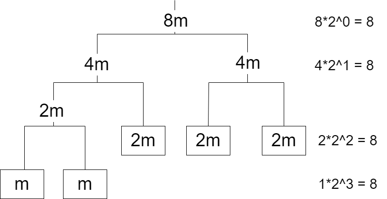

题目：[洛谷·UVa 12166](https://www.luogu.com.cn/problem/UVA12166)

## 题意
>给一个深度不超过16的二叉树，代表一个天平。每根杆都悬挂在中央，每个秤砣的重量已知。至少修改多少个秤砣的重量才能让天平平衡？<br>——刘汝佳《算法竞赛入门基础》

## 分析
乍一看似乎无从下手，我们可以先来研究一下平衡的天平具有什么性质

把每一个子天平都看作一个秤砣，若天平平衡，则其总重量等于其中一个秤砣的重量乘以2

设天平的深度为$ depth $。通过下图我们发现：



>$ 天平的总重量 = 任意一个秤砣的重量（包括把子天平看作秤砣） \times 2^{depth} $

于是只要读入天平，记录 $ num \times 2^{depth} $ （`num`为秤砣的重量）重复的次数，结果为：

>$ 最少修改数 =  结点总数 - max(num \times 2^{depth}重复的次数) $

利用STL的map映射可以很方便地解决本题

## 代码

```C++
#define IOS ios::sync_with_stdio(false);cin.tie(0);cout.tie(0);
#define LL long long
#include <iostream>
#include <string>
#include <algorithm>
#include <cctype>
#include <map>
using namespace std;

map<LL, int> cnt;  // map映射：记录num*2**depth重复的次数

int solve(string s) {
    int depth = 0, sum = 0, maxn = 0;  // 二叉树深度，结点总数，不需更改的结点数
    int len = s.length();
    for (int i = 0; i < len; i++) {
        if (s[i] == '[') depth++;
        if (s[i] == ']') depth--;
        if (isdigit(s[i])) {
            LL num = 0;
            for (; isdigit(s[i]); i++) { num *= 10; num += s[i] - '0'; }  // 字符转整数
            i--;  // 防止for循环导致的差1错误
            sum++;
            cnt[num << depth]++;  // cnt[num*2**depth]++
            maxn = max(maxn, cnt[num << depth]);
        }
    }
    return sum - maxn;
} 

int main() {
#ifdef LOCAL
    freopen("uva12166.in", "r", stdin);
    freopen("uva12166.out", "w", stdout);
#endif
    IOS
    int t;
    string s;
    cin >> t;
    while (t--) {
        cnt.clear();
        cin >> s;
        cout << solve(s) << endl;
    }
    return 0;
}
```

C++ STL的map跟Python的字典很像，但也有区别：map能引用未赋值的键值对，且其值默认为0；而Python不能引用未定义的键值对

## 附录
### 参考文献
[1][https://www.luogu.com.cn/blog/Einstein-study/solution-uva12166](https://www.luogu.com.cn/blog/Einstein-study/solution-uva12166) <br>
[2]刘汝佳《算法竞赛入门基础》
