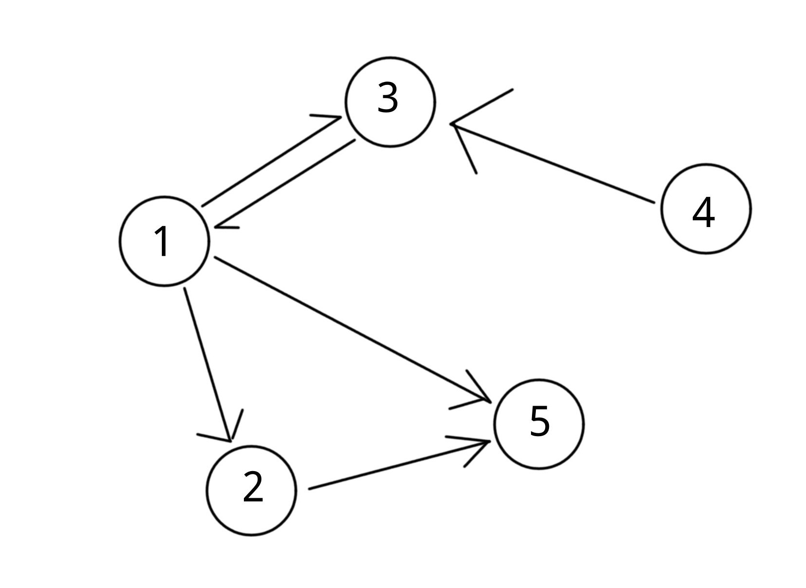
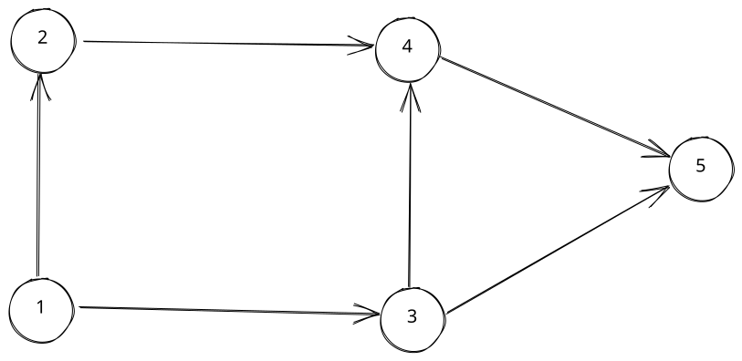

## 引言

### 什么是图论？

**图论**是离散数学的一个十分有趣的分支，以 **“图”** 为主要研究对象，研究图的内在结构，探索其中的组合性质、代数性质和拓扑性质，找到满足条件的“好图”等。比如大名鼎鼎的七桥问题（欧拉回路）就属于图论的范畴

### 那么，图又是什么呢？

简单来说，**图（Graph）** 是由多个点以及连接这些点的线所构成的对象。具体定义详见[维基百科·图](<https://zh.wikipedia.org/wiki/%E5%9B%BE_(%E6%95%B0%E5%AD%A6)>)、[OI Wiki·图论相关概念](https://oi-wiki.org/graph/concept/)


在计算机中，图也是一种相当重要的数据结构，最短路、最小生成树、网络流等问题往往需要图来实现

## 图的存储

> 本文约定用 $ n $ 代指图的点数，用 $ m $ 代指图的边数，用 $ d^+(u) $ 代指点 $ u $ 的出度，即以 $ u $ 为出发点的边数

### 邻接矩阵

#### 方法

从图的概念我们知道，图由点集和边集组成。而我们可以用一个二维数组`G`来存边，`G[u][v] = 1`表示存在从`u`到`v`的边。如果边带权值`w`，可以令`G[u][v] = w`

```C++
#include <iostream>
#include <cstring>
using namespace std;

const int maxn = 1000;
int n, m;
bool vis[maxn];
int G[maxn][maxn];

// 查找边(u,v)是否存在
bool find_edge(int u, int v) { return G[u][v]; }

void dfs(int u) {
    if (vis[u]) return;
    vis[u] = true;
    cout << u << ' ';
    for (int v = 1; v <= n; v++)
        if (G[u][v]) dfs(v);
}

int main() {
    // 一共有n个点,m条边
    cin >> n >> m;
    for (int i = 1; i <= m; i++) {
        int u, v, w;
        cin >> u >> v >> w;
        G[u][v] = w;
    }
    cout << endl;

    for (int i = 1; i <= n; i++) {
        memset(vis, false, sizeof(vis));
        dfs(i);
        cout << '\n';
    }
    cout << endl;

    cout << find_edge(3, 1) << endl;
    cout << find_edge(4, 5) << endl;
    return 0;
}
/* 输入示例：
5 6
1 2 1
2 3 2
1 3 3
3 1 10
3 4 3
5 2 7
*/
```

> 例题：[P1359 租用游艇](https://www.luogu.com.cn/problem/P1359)

利用邻接矩阵来存储图，注意在本题中邻接矩阵为半矩阵（类似于上三角矩阵，但主对角线元素为0， 即`a[i][i] = 0`）。需要注意的是，单纯dfs会超时，需要剪枝

动态规划也可以解，而且代码非常简洁（貌似本来是就动态规划的题，被我硬生生写成dfs😂）

#### 复杂度

查询是否存在某条边：$ O(1) $

遍历一个点的所有出边：$ O(n) $

遍历整张图：$ O(n^2) $

空间复杂度：$ O(n^2) $

#### 应用

邻接矩阵只适用于没有重边（或重边可以忽略）的情况

其最显著的优点是可以$ O(1) $查询一条边是否存在

由于邻接矩阵在**稀疏图**上效率很低（尤其是在点数较多的图上，空间无法承受），所以一般只会在**稠密图**上使用邻接矩阵

（以上关于复杂度和应用的资料来源于[OI Wiki·图的存储](https://oi-wiki.org/graph/save/)，下同）

### 邻接表

#### 方法

我们可以为各个点分别存储与它相关联的边，如：

```
1: -->a -->b -->c
2: -->b -->c
3: -->c -->d -->e
4: -->a -->d
```

可以看出邻接表是一种链表，它是以任意顺序来存储边的。但在算法竞赛中，我们可以用数组或`vector`来模拟链表

我们也可以存储边的终点，比如下图：



```
1: [2, 3, 5]
2: [5]
3: [1]
4: [3]
5: []
```

如果是无向边，只需两个端点都存一遍即可，比如无向边`(1, 2)`:

```
1: [2]
2: [1]
```

下面是C++代码实现：

```C++
#include <iostream>
#include <vector>
using namespace std;

struct Node {
    int v;  // 边的终点
    int w;  // 边权
};

int n, m;
vector<int> vis;
vector<vector<Node> > G;  // 存储点 u 的所有出边的相关信息（终点、边权等）

// 查找边(u,v)是否存在
bool find_edge(int u, int v) {
    for (int i = 0; i < (int)G[u].size(); i++)
        if (G[u][i].v == v) return true;
    return false;
}

void dfs(int u) {
    if (vis[u]) return;
    vis[u] = 1;
    cout << u << ' ';
    for (int i = 0; i < (int)G[u].size(); i++) dfs(G[u][i].v);
}

int main() {
    // 一共有n个点,m条边
    cin >> n >> m;

    vis.resize(n+1, false);
    G.resize(n+1);

    for (int i = 1; i <= m; i++) {
        int u, v, w;
        cin >> u >> v >> w;
        G[u].push_back({v, w});
    }

    for (int i = 1; i <= n; i++) {
        dfs(i);
        cout << endl;
    }

    cout << find_edge(1, 2) << endl;

    return 0;
}

```

#### 复杂度

查询是否存在 u 到 v 的边：$ O(d^+(u)) $ （如果事先进行了排序就可以使用**二分查找**做到$ O(\log(d^+(u))) $ ）

遍历点 u 的所有出边：$ O(d^+(u)) $

遍历整张图：$ O(n+m) $

空间复杂度：$ O(m) $

#### 应用

存各种图都很适合，除非有特殊需求（如需要快速查询一条边是否存在，且点数较少，可以使用邻接矩阵）

尤其适用于需要对一个点的所有出边进行排序的场合

### 链式前向星

#### 方法

邻接表的升级版，其实就是静态建立的邻接表

其特点是对边进行编号，第一条边编号为`0`

关键是理解一下变量：

- 边集数组：`e[i]`存储第 i 条边的边权
- `ne`，表示与这个边起点相同的上一条边的编号
- 头结点数组：`h[i]`表示以 i 为起点的最后一条边的编号

`h`数组一般初始化为-1，遍历图时`ne = -1`做为终止条件

```C++
#include <iostream>
#include <cstring>
#include <algorithm>
using namespace std;

const int N = 1e5 + 10;
int n, m, idx;
int h[N], ne[N], to[N], e[N], vis[N];


// h[u]初始值为 -1
void add_edge(int u, int v, int w) {
    to[idx] = v;     // 终点
    e[idx] = w;      // 边权
    ne[idx] = h[u];  // 以 u 为起点的上一条边的编号
    h[u] = idx++;    // 更新以 u 为起点上一条边的编号
}

void dfs(int u) {
    cout << u << ' ';
    vis[u] = true;
    for (int i = h[u]; ~i; i = ne[i]) {  // ~i 相当于 i != -1
        if (!vis[to[i]]) dfs(to[i]);
    }
}

void print() {   // 遍历各点出边终点
    for (int i = 1; i <= n; i++) {
        cout << i << ": ";
        for (int j = h[i]; ~j; j = ne[j])
            cout << to[j] << ' ';
        cout << "\n";
    }
}

int main() {
    memset(h, -1, sizeof(h));  // 初始化；ne[i] = -1表示到达终点

    // 存图
    cin >> n >> m;
    for (int i = 1; i <= m; i++) {
        int u, v, w;
        cin >> u >> v >> w;
        add_edge(u, v, w);
        // add_edge(v, u, w);  // 无向边

        // 输出存储过程
        cout<<"to["<<idx-1<<"] = "<<to[idx-1]<<"; "
            <<"ne["<<idx-1<<"] = "<<ne[idx-1]<<"; "
            <<"h["<<u<<"] = "<<h[u]<<";\n";
    }

    print();

    for (int i = 1; i <= n; i++) {
        memset(vis, 0, sizeof(vis));
        dfs(i);
    }

    // 输出存储结果
    cout << "\n";
    for (int i = 0; i <= n; i++) {
        cout << "h[" << i << "] = " << h[i] << ", ";
        cout << "ne[" << i << "] = " << ne[i] << ", ";
        cout << "to[" << i << "] = " << to[i] << ", ";
        cout << "e[" << i << "] = " << e[i] << ",\n";
    }
    return 0;
}
/*  输入示例：
4 3
1 2 5
2 4 10
4 3 15
*/
```

#### 复杂度

查询是否存在 u 到 v 的边：$ O(d^+(u)) $

遍历点 u 的所有出边：$ O(d^+(u)) $

遍历整张图：$ O(n+m) $

空间复杂度：$ O(m) $

#### 应用

存各种图都很适合，但不能快速查询一条边是否存在，也不能方便地对一个点的出边进行排序

优点是边是带编号的，有时会非常有用，而且如果`idx`的初始值为奇数，存双向边时`i ^ 1`即是`i`的反边（常用于**网络流**）

#### 例题

[P3916 图的遍历](https://www.luogu.com.cn/problem/P3916)

这道题的技巧是反向存图，以便反向查找各点所能到达的编号最大的点，即：

```
cin >> u >> v >> w;
add_edge(v, u);
```

反向DFS得出结果：

```
for (int i = n; i > 0; i--)
    if (!vis[i]) dfs(i, i);
```

最后输出`vis[]`即可

## 图论相关问题

### 拓扑排序

在[图论](https://zh.wikipedia.org/wiki/%E5%9B%BE%E8%AE%BA "图论")中，由一个[有向无环图](https://zh.wikipedia.org/wiki/%E6%9C%89%E5%90%91%E6%97%A0%E7%8E%AF%E5%9B%BE "有向无环图")的顶点组成的序列，当且仅当满足下列条件时，才能称为该[图](https://zh.wikipedia.org/wiki/%E5%9B%BE "图")的一个拓扑排序（英语：**Topological sorting**）：

- 1. 序列中包含每个顶点，且每个顶点只出现一次；
- 2. 若A在序列中排在B的前面，则在图中不存在从B到A的[路径](<https://zh.wikipedia.org/wiki/%E8%B7%AF%E5%BE%84_(%E5%9B%BE%E8%AE%BA)> "路径 (图论)")。

所谓拓扑排序，就是由一个偏序关系得到一个全序关系。通俗来讲，就是要按照一个特定次序来遍历图的所有序号：遍历一个结点前，需保证指向它的所有结点已经遍历。可以看出，只有有向无环图（**DAG**）才有拓扑序

我们可以构思出这样一个算法：

```Python
L = []  # 拓扑序
while 存在结点入度为1：
    任选一个入度为1的结点u
    L.append(u)
    for v in G[u]:
        v的度数 -= 1
    从图中删除u结点
if len(L) == 初始图总结点数：
    return True  # 拓扑序存在
else:
    return False
```

比如下图：


```
# 它的拓扑序可以是：
1 2 3 4 5
# 也可以是：
1 3 2 4 5
```

可以用BFS或DFS来实现拓扑排序。由于只需遍历一遍结点，复杂度相当客观，为$O(V+E)$

#### BFS

```C++
int n, m, _in[N];  // 点数，边数，入度
bool vis[N];
vector<vector<int>> G;
vector<int> topo;


bool toposort() {
    queue<int> q;
    for (int i = 1; i <= n; i++) {
        if (!_in[i]) q.push(i);
    }
    while (!q.empty()) {
        int u = q.front();
        q.pop();
        topo.emplace_back(u);
        for (auto &v : G[u]) {
            _in[v]--;
            if (!_in[v]) q.push(v);
        }
    }
    return (int)topo.size() == n;
}
```

#### DFS

```C++
void dfs(int i) {
    if (!_in[i] && !vis[i] && !tmp[i]) {
        topo.emplace_back(i);
        vis[i] = true;
        tmp[i] = true;  // 临时标记。如果遍历到已标记结点，说明不是DAG
        for (auto &j : G[i]) {
            _in[j]--;
            dfs(j);
        }
        tmp[i] = false;
    }
}

bool toposort() {
    for (int i = 1; i <= n; i++) dfs(i);
    return ((int)topo.size() == n);
}
```

#### 例题

> [Codeforces Round 748 (Div. 3) E.Gardener and Tree](https://codeforces.com/contest/1593/problem/E)

题意:给出一棵无根树，每次操作删除所有叶子结点，问k次操作后还剩几个结点

类比拓扑排序，每次操作选出度数为1的结点，遍历其终边并使终点度数减1,然后删除这些结点。注意：题目给出的树是无向的，因此不能直接用DFS（比如树为一条单链，DFS会直接从一头遍历到另一头），而BFS会更好写，代码也是类似的，唯一的区别是，要判断删点前其邻接点度数为1的情况（说明邻接点已经在队列里了）

```C++
#include <bits/stdc++.h>

#define IOS ios::sync_with_stdio(false);cin.tie(0);cout.tie(0);
#define _all(x) (x).begin(), (x).end()
#define _abs(x) ((x >= 0) ? (x) : (-x))
#define PII pair<int, int>
#define PLL pair<LL, LL>
#define PDD pair<double, double>
#define fi first
#define se second

typedef long long LL;
typedef long double LD;
typedef unsigned long long ULL;

const int INF = 0x3f3f3f3f;
const double PI = acos(-1.0);

using namespace std;

const int N = 4e5 + 10;
int d[N], vis[N], n, k;  // d[]为结点度数，vis[]为操作次数
vector<vector<int>> G;


void init() {
    memset(d, 0, sizeof(d));
    memset(vis, 0, sizeof(vis));
    cin >> n >> k;
    G.clear();
    G.resize(n+1);
    for (int i = 0; i < n-1; i++) {
        int u, v;
        cin >> u >> v;
        G[u].emplace_back(v);
        G[v].emplace_back(u);
        d[u]++, d[v]++;
    }
}

// 基于BFS的拓扑排序
void solve() {
    queue<int> q;
    for (int i = 1; i <= n; i++) {
        if (d[i] == 1) {
            q.push(i);
            vis[i] = 1;
        }
    }
    while (!q.empty()) {
        int u = q.front();
        q.pop();
        for (auto &v : G[u]) {
            // 邻接点度数为1,说明其已经在队列内
            if (d[v] != 1) {
                d[v]--;
                // 删去点u后v度数为1,v入队
                if (d[v] == 1) {
                    vis[v] = vis[u] + 1;
                    q.push(v);
                }
            }
        }
    }
    int ans = 0;
    for (int i = 1; i <= n; i++) {
        if (vis[i] > k) ans++;
    }
    cout << ans << "\n";
}

int main() {
    IOS
    int test_case;
    cin >> test_case;
    while (test_case--) {
        init();
        solve();
    }
    return 0;
}
```

### 欧拉道路、欧拉回路

（待填坑……）

### 最小生成树

（待填坑……）

## 附录

### 参考文献

[1][维基百科·图论](https://zh.wikipedia.org/wiki/%E5%9B%BE%E8%AE%BA)

[2][OI Wiki·图论相关概念](https://oi-wiki.org/graph/concept/)

[3][OI Wiki·图的存储](https://oi-wiki.org/graph/save/)

[4]宫崎修一《程序员的数学4：图论入门》

[5][链式前向星--最通俗易懂的讲解](https://blog.csdn.net/sugarbliss/article/details/86495945)
