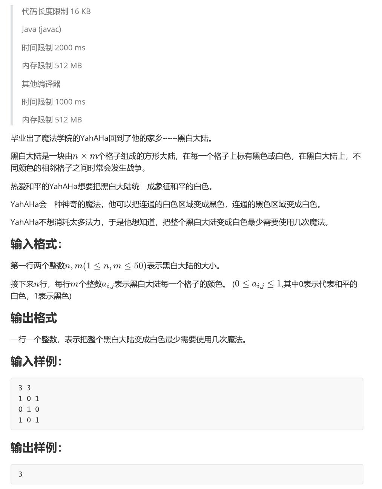

## 题目



## 分析

> 题意：给出一个 $ m \times n $ 的布尔矩阵，每次可以进行一下两种操作之一：
>
> - 选择一个元素 $(i,j)$ ，如果：
>   - $ a\_{i,j} = 1 $：将该点和与其相邻的所有$1$都变成$0$
>   - $ a\_{i,j} = 0 $：将该点和与其相邻的所有$0$都变成$1$
>     求把整个矩阵都变为$0$所需的最少步数

显然，我们需要用DFS来判断连通块。可以写两个DFS分别判断黑色（1）和白色（0）连通块，把连通块看作结点，判连通块的同时根据连通块之间的接壤关系组织成图。如果`a[i][j] == 1`，则`vis[i][j] = idx`，否则`vis[i][j] = -idx`，idx为结点编号

求从某一个点开始操作，把整个图都变为$0$的步数，即求从该点出发遍历整个图的步数。也就是说，我们可以用BFS求出该点到所有点的***最短路***（**特别的，如果最短路终点的值为 $1$ ，则最短路的长度要 $+1$ ，因为把整条路径都变为 $0$ 需要再多加一步**），取最短路的最大值为 $t$ ，然后对每个结点都做一次BFS，$min\\{t\\}$ 即为答案

结点数不大于 $50 \times 50 = 2500$ 个，用邻接表存图比较方便，且不会超时

注意到重边不会影响BFS（结点一入队就被打上访问标记），因此存图时不用判重，省下了 $O(\sum_{u=1}^{idx} d^{+}(u-1)!)$ （$idx$为结点编号最大值） 的时间复杂度，也就是“用空间换时间”<br>
~~（事实上，本题加上判重操作也能AC,不差这点时间复杂度）~~

总时间复杂度为：DFS + BFS<br>
$O(nm)$ + $O((n + m) \times (n + m + \sum_{u=1}^{n + m} d^{+}(u)))$

## 代码

```C++
#include <bits/stdc++.h>
#define IOS ios::sync_with_stdio(false);cin.tie(0);cout.tie(0);
using namespace std;

const int N = 50 + 5;
const int dx[] = {1,0,-1,0};
const int dy[] = {0,1,0,-1};
const int INF = 0x3f3f3f3f;
int n, m, a[N][N], vis[N][N], c[N*N], idx = 1, ans = INF;
// a存储输入，vis存储连同块（结点）编号，c存储结点颜色
bool bvis[N*N];  // 用于BFS判断结点是否已访问
vector<vector<int>> G;  // 邻接表


struct Node {
    int idx, step;
};

// 检查是否在界线内
bool check(int x, int y) {
    return 1 <= x && x <= n && 1 <= y && y <= m;
}

// 判断黑连通块并建图
bool dfs1(int x, int y) {
    if (vis[x][y] > 0) return false;  // 不是黑连通块
    // 与白连通块接壤，建边
    if (a[x][y] == 0) {
        if (vis[x][y] < 0) {  // 重边不影响BFS,不用判重
            G[idx].push_back(-vis[x][y]);
            G[-vis[x][y]].push_back(idx);
        }
        return false;
    }

    vis[x][y] = idx;  // 访问标记，也是结点编号
    c[idx] = 1;  // 结点颜色为黑（1）

    // 继续DFS
    for (int i = 0; i < 4; i++) {
        int nx = x + dx[i], ny = y + dy[i];
        if (check(nx, ny) && vis[nx][ny] <= 0) dfs1(nx, ny);
    }
    return true;  // 是黑连通块
}

// 判断白连通块并建图
bool dfs0(int x, int y) {
    if (vis[x][y] < 0) return false;
    // 与黑连通块接壤，建边
    if (a[x][y] == 1) {  // 重边不影响BFS,不用判重
        if (vis[x][y] > 0) {
            G[idx].push_back(vis[x][y]);
            G[vis[x][y]].push_back(idx);
        }
        return false;
    }

    vis[x][y] = -idx;  // 访问标记，也是结点编号
    // 结点颜色为白（0）。不做操作，因为 c 初始值为 0

    // 继续DFS
    for (int i = 0; i < 4; i++) {
        int nx = x + dx[i], ny = y + dy[i];
        if (check(nx, ny) && vis[nx][ny] >= 0) dfs0(nx, ny);
    }
    return true;
}

// 求无权图上的最短路
void bfs(int k) {
    memset(bvis, 0, sizeof(bvis));
    int t = -INF;  // 存储到各个结点的最短路的最大值
    Node tmp;
    queue<Node> q;
    q.push({k, 0});
    bvis[k] = true;
    while (!q.empty()) {
        tmp = q.front();
        q.pop();
        t = max(t, (c[tmp.idx] ? tmp.step+1 : tmp.step));  // 如果最短路终点为黑色（1），则步数+1
        for (auto i : G[tmp.idx]) {
            if (!bvis[i] && i != idx) {
                q.push({i, tmp.step+1});
                bvis[i] = true;
            }
        }
    }
    ans = min(ans, t);
}

// 求出从各点出发到所有点的最短路的最大值的最小值
void solve() {
    for (int i = 1; i < idx; i++) bfs(i);
    cout << ans << endl;
}

// 读入数据并建图
void init() {
    cin >> n >> m;
    for (int i = 1; i <= n; i++)
        for (int j = 1; j <= m; j++) cin >> a[i][j];

    G.resize(2500+1);

    for (int i = 1; i <= n; i++)
        for (int j = 1; j <= m; j++) {
            if (a[i][j]) if (dfs1(i, j)) idx++;
            if (!a[i][j]) if (dfs0(i, j)) idx++;
        }
}

int main() {
#ifdef LOCAL
    freopen("E_2.in", "r", stdin);
#endif
    IOS
    init();
    solve();

    // 遍历结点颜色
    // for (int i = 1; i < idx; i++) cout << c[i] << ' ';
    // cout << endl << endl;

    // 遍历访问数组
    // for (int i = 1; i <= n; i++) {
    //     for (int j = 1; j <= m; j++) cout << vis[i][j] << ' ';
    //     cout << endl;
    // } cout << endl;

    // 遍历邻接表
    // for (int i = 1; i < idx; i++) {
    //     cout << i << ": ";
    //     for (auto j : G[i]) cout << j << ' ';
    //     cout << endl;
    // }

    return 0;
}

```

## 数据生成器

附赠数据生成器

> E_in.py

```Python
from random import *
import sys

sys.stdout = open(r"E_2.in", "w")

# n = randint(1, 50)
# m = randint(1, 50)
n, m = 50, 50

print(n, m)
for _ in range(n):
    for _ in range(m):
        print(randint(0, 1), end=" ")
    print()
```

## 总结

上周末打的虚拟赛，我负责E题。虽然一上来就想到了DFS建图，然而还不熟练，错漏百出：邻接表建图出错、BFS漏写访问标记，~~以至于全程挂机（bushi）~~。还要加强训练，~~我也是加把劲ACMer~~
