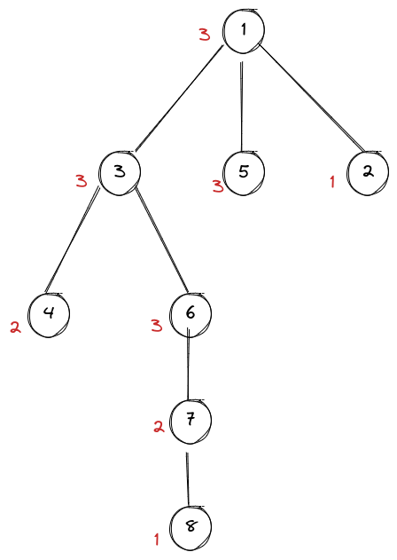

## 原题

### 题目描述

You are given a graph with $n$ vertices and $m$ undirected edges of length $1$. You can do the following operation on the graph for arbitrary times:

> Choose an edge $(u,v)$ and replace it by two edges, $(u,w)$ and $(w,v)$, where $w$ is a newly inserted vertex. Both of the two edges are of length $1$.

You need to find out the maximum number of vertices whose minimum distance to vertex $1$ is no more than $k$.

### 输入描述

The first line contains three integers $n (1≤n≤10^5)$, $m (0≤m≤2⋅10^5)$ and $k (0≤k≤10^9)$.
Each of the next $m$ lines contains two integers $u$ and $v (1≤u,v≤n)$, indicating an edge between $u$ and $v$. It is guaranteed that there are no self-loops or multiple edges.

### 输出描述

Output an integer indicating the maximum number of vertices whose minimum distance to vertex $1$ is no more than $k$.

#### 示例1

输入

```
5 4 2
1 2
2 3
3 1
4 5
```

输出

```
5
```

#### 示例2

输入

```
8 9 3
1 2
1 3
1 5
3 4
3 6
4 5
5 6
6 7
7 8
```

输出

```
15
```

#### 示例3

输入

```
114 0 514
```

输出

```
1
```

### 备注:

Here is the illustration for the second example.


## 题意

给出一个边长为$ 1 $的**无向图**，其中每条边都可以插入数量任意的结点。求到结点$1$距离不大于$k$的结点数的最大值

## 分析

以样例2为例：


显然，对于度数为1的结点（如结点2），可以在它和与其相关联的点之间插入任意个结点，而不影响其他的点。即：度数为1的结点所在的边最多贡献$k$个结点

先从 $1$ 开始 BFS，同时求出每个点到 $1$ 的最短路

画出BFS树，并标出各点的度数



考虑选什么边来加点，两种情况：

- 第一种，删除该边不影响任何一个点到 $1$ 的最短距离。若一个点到 $1$ 的最短距离小于等于 $k$ 且该点度数大于等于 $2$，则存在 度数 - $2$ 条这样的边（如 $(3,4)$、 $(4,5)$、 $(5,6)$，这三条边分别可提供$2$、$2$、$1$ 个贡献）

- 第二种，删除该边影响某点到 $1$ 的最短路，那么这样的整个分支最多为答案提供 $k$ 的贡献（如 $(1,2)$ ）

于是先假设所有与结点 $1$ 相关联的点都为第二种点，然后再选边加点

可用链式前向星存图

## 代码

```C++
#include <bits/stdc++.h>

#define IOS ios::sync_with_stdio(false);cin.tie(0);cout.tie(0);
#define _all(x) (x).begin(), (x).end()
#define _abs(x) ((x >= 0) ? (x) : -(x))
#define PII pair<int, int>
#define PLL pair<LL, LL>
#define PDD pair<double, double>
#define fi first
#define se second

typedef long long LL;
typedef long double LD;
typedef unsigned long long ULL;

const int INF = 0x3f3f3f3f;
const LL LINF = 0x3f3f3f3f3f3f3f3f;
const double PI = acos(-1.0);
using namespace std;

const int N = 1e5 + 10;
const int M = 2e5 + 20;
int n, m, k, idx;
int h[N], to[M*2], ne[M*2], d[N], dis[N];  // d[] 度数


void add(int u, int v) {
    to[idx] = v, ne[idx] = h[u], h[u] = idx++;
}

void init() {
    memset(h, -1, sizeof(h));
    memset(dis, -1, sizeof(dis));
    dis[1] = 0;
    cin >> n >> m >> k;
    for (int i = 0; i < m; i++) {
        int u, v;
        cin >> u >> v;
        add(u, v);
        add(v, u);
        d[u]++;
        d[v]++;
    }
}

void bfs() {
    queue<int> q;
    q.push(1);
    while (!q.empty()) {
        int t = q.front();
        q.pop();
        for (int i = h[t]; ~i; i = ne[i]) {  // ~i 等价于 i != -1
            int v = to[i];
            if (dis[v] == -1) {
                dis[v] = dis[t] + 1;
                q.push(v);
            }
        }
    }
}

void solve() {
    bfs();
    LL ans = 1 + d[1] * k;  // 记得加上结点 1 本身
    // 选边加点
    for (int i = 2; i <= n; i++) {
        if (~dis[i] && d[i] >= 2 && dis[i] < k) {
            ans += (LL)(k - dis[i]) * (LL)(d[i] - 2);
        }
    }
    cout << ans << "\n";
}

int main() {
    IOS
    init();
    solve();
    return 0;
}

```

## 附录

### 参考文献

[https://ac.nowcoder.com/acm/discuss/blogs?tagId=253614](https://ac.nowcoder.com/acm/discuss/blogs?tagId=253614)
